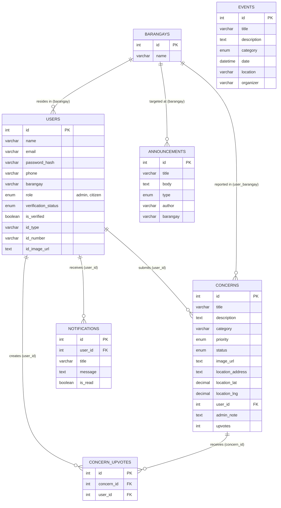
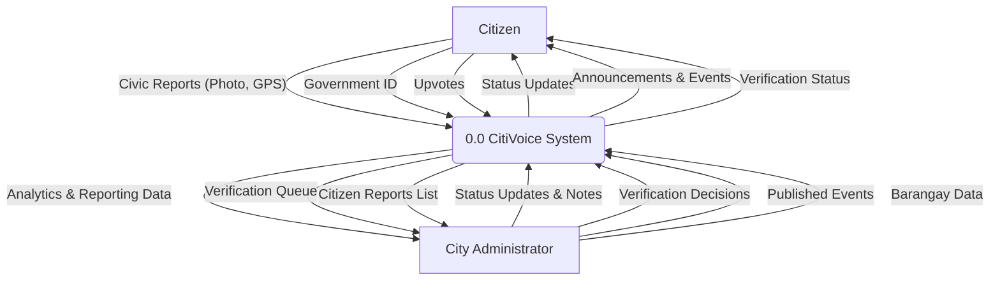
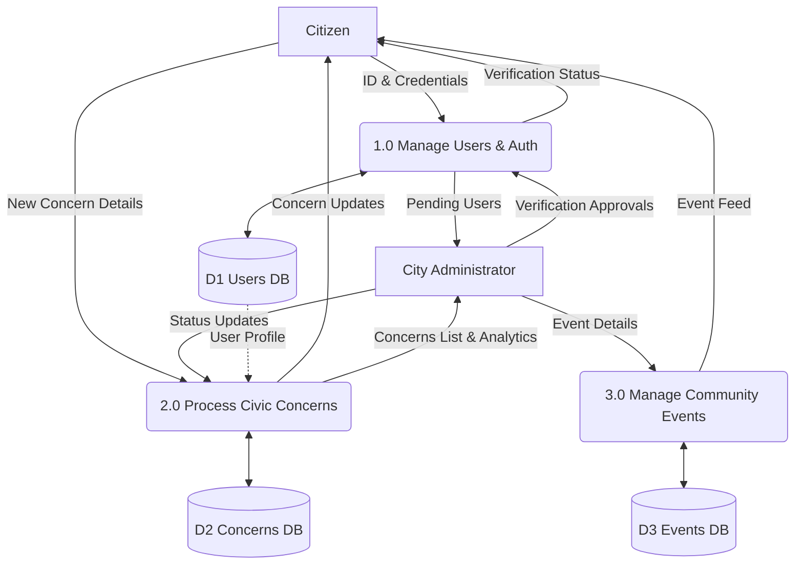
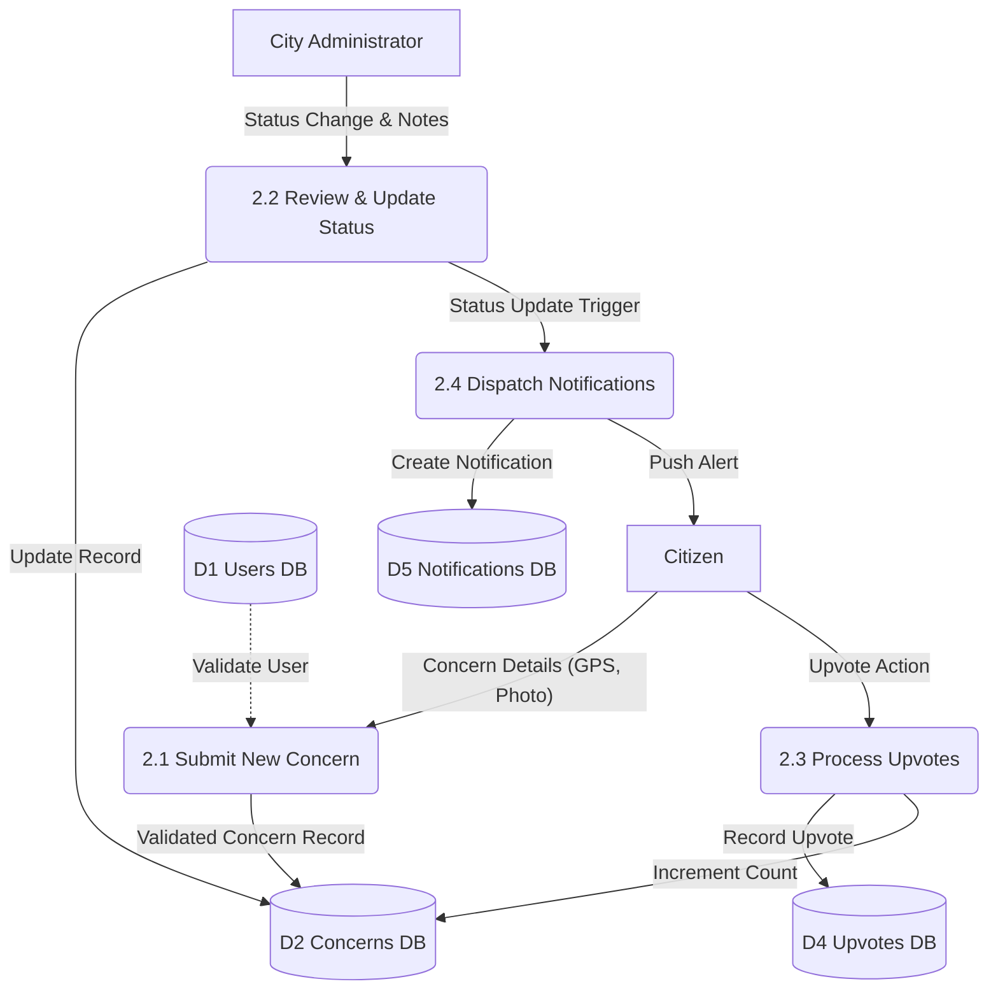

# CitiVoice Diagrams

Here are the Entity Relationship Diagram (ERD) and Data Flow Diagram (DFD) for the CitiVoice project. 

> [!TIP]
> **How to use this in Figma:**
> 1. In Figma, go to **Plugins** and search for **"Mermaid"** (there are several free ones like *Mermaid to Figma* or *Mermaid Chart*).
> 2. Run the plugin and copy-paste the raw Mermaid code block below into it.
> 3. It will automatically draw the diagrams for you inside Figma as editable vectors!

---

## Entity Relationship Diagram (ERD)

This diagram shows the database structure and how the different tables relate to each other.

---

## Data Flow Diagram (DFD) - Level 0 Context (Gane-Sarson)

This diagram illustrates how information flows between the external entities and the core system using Gane-Sarson conventions (External Entities as squares, Processes as rounded rectangles).

## Data Flow Diagram (DFD) - Level 1 (Gane-Sarson)

This breaks down the Level 0 process into sub-processes and introduces Data Stores (open-ended rectangles).

## Data Flow Diagram (DFD) - Level 2 (Process 2.0 Civic Concerns)

This diagram explodes **Process 2.0 (Process Civic Concerns)** into its detailed sub-processes, showing how concerns are submitted, upvoted, updated, and how notifications are triggered.

